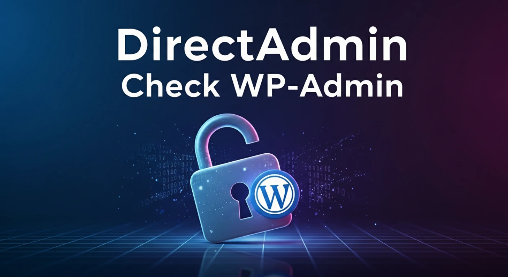

# 🚀 DirectAdmin Check WP-Admin

Readme: [English](README.md)




`da-checkwpadmin.sh` é uma ferramenta de auditoria de segurança desenvolvida
para servidores DirectAdmin. Seu objetivo crítico é varrer todas as contas de
usuários, identificar instalações WordPress e listar usuários com privilégios
de Administrador que não fazem parte da whitelist da equipe (ex.:
`root@dominio.com.br` ou `dev@dominio.com.br`).

Ideal para identificar contas administrativas suspeitas, esquecidas ou criadas por atacantes em servidores compartilhados.

🚀 Principais Funcionalidades

- **Varredura Global**: Itera automaticamente por todos os usuários do
  DirectAdmin (`/home/*`), verificando instalações em
  `/home/<usuario>/public_html`.
- **Detecção de WordPress**: Valida se o diretório contém uma instalação ativa do WP.
- **Auditoria de Admin (WP-CLI)**: Usa wp user list para extrair usuários com a função administrator.
- **Modo de Segurança**: Executa comandos com --skip-plugins e --skip-themes para garantir que a auditoria funcione mesmo em sites com erros fatais ou conflitos.
- **Whitelist Inteligente**: Ignora usuários administrativos padrão da infraestrutura (ex.: *`@domain.com.br`), focando apenas em usuários desconhecidos.
- **Relatório CSV diário**: Gera arquivo `.csv` consolidado no formato
  `status_admins_wp_YYYYMMDD.csv`.
- **Feedback Visual**: Exibe uma barra de progresso durante a execução no terminal.
- **Alerta por Email**: Envia automaticamente o relatório final para o email configurado.
- **Auditoria de Execução (Log)**: Registra início/fim da auditoria, arquivo
  gerado e status de envio de e-mail em `/var/log/wp_audit.log`.
- **Mensagens em PT/EN**: Adapta automaticamente textos de terminal, assunto e
  corpo do e-mail conforme `LANG`.

🛠️ Pré-requisitos
- Servidor com **DirectAdmin** e acesso **root**.
- **WP-CLI** instalado e acessível globalmente.
- Pacote `mail` ou similar configurado para envio do relatório.

## 📦 Instalação e Uso

**1. Download do Script**

```bash
wget https://raw.githubusercontent.com/sr00t3d/directadmin-checkwp-admin/refs/heads/main/da-checkwpadmin.sh
chmod +x da-checkwpadmin.sh
```
**2. Configuração (Opcional)**

Edite o cabeçalho do script para ajustar destinatário, whitelist e opções de
auditoria:

```bash
# Exemplo de variáveis internas
RECIPIENT_MAIL="seu-email@dominio.com.br"
WHITELIST_EMAILS="root@domain.com.br dev@domain.com.br"
CSV_FILE="status_admins_wp_$(date +%Y%m%d).csv"
LOG_FILE="/var/log/wp_audit.log"
```

**3. Execução**

Execute o script como root para garantir acesso a todos os diretórios dos usuários:

```bash
./da-checkwpadmin.sh
```

## 📊 Estrutura do Relatório (CSV)

O arquivo gerado (`status_admins_wp_YYYYMMDD.csv`) segue o padrão:

```
DOMAIN    COUNTER    ADMIN_LIST
site.com  4          hacked1  noobmaster3  lolhehehe  igotyoursite
```

## 🧾 Auditoria e histórico

Além do CSV, o script grava histórico em `/var/log/wp_audit.log` com:

- Início da auditoria (data e horário).
- Fim da auditoria (data e horário).
- Nome do CSV gerado.
- Resultado do envio de e-mail (sucesso, falha, ou comando `mail` ausente).

## ⚠️ Tratamento de Erros

- O script foi projetado para **não interromper** a execução caso encontre um site quebrado. Ele:
- Ignora erros PHP do site (via flags do WP-CLI).
- Registra "Erro ao ler WP" no relatório se o wp-config.php estiver ilegível ou o banco de dados estiver inacessível.

## ⚠️ Aviso Legal

> [!WARNING]
> Este software é fornecido "como está". Certifique-se sempre de testar primeiro em um ambiente de desenvolvimento. O autor não se responsabiliza por qualquer uso indevido, consequências legais ou impacto em dados causado por esta ferramenta.

## 📚 Tutorial Detalhado

Para um guia completo passo a passo, confira meu artigo completo:

👉 [**Verificação em Massa de Admins no WordPress no DirectAdmin**](https://perciocastelo.com.br/blog/mass-check-admins-in-wordPress-on-directAdmin.html)

## Licença 📄

Este projeto é licenciado sob a **GNU General Public License v3.0**. Veja o arquivo [LICENSE](LICENSE) para mais detalhes.
